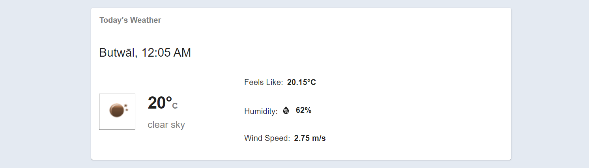
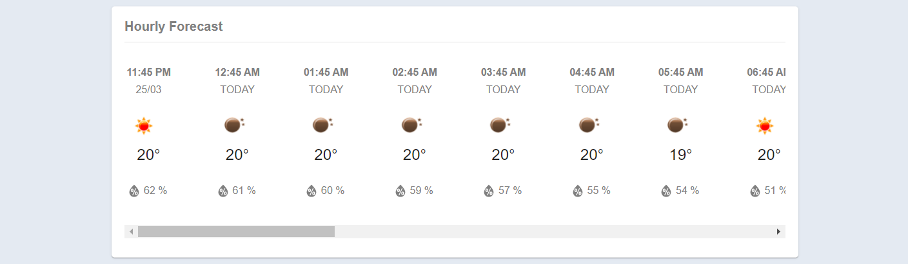
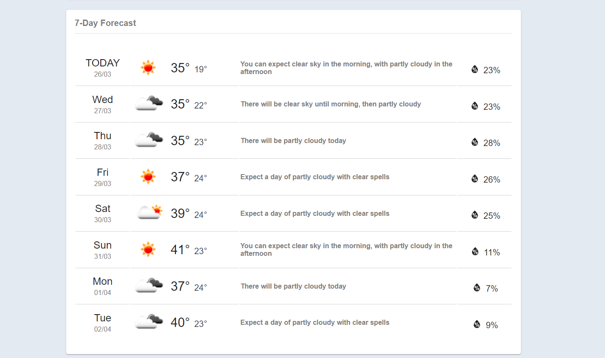
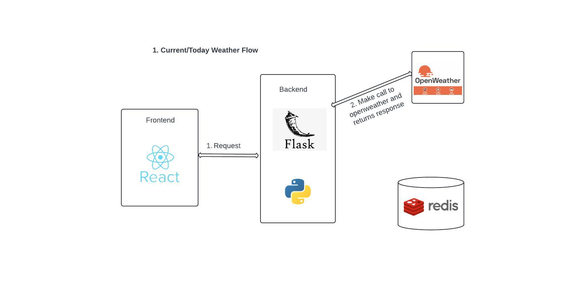
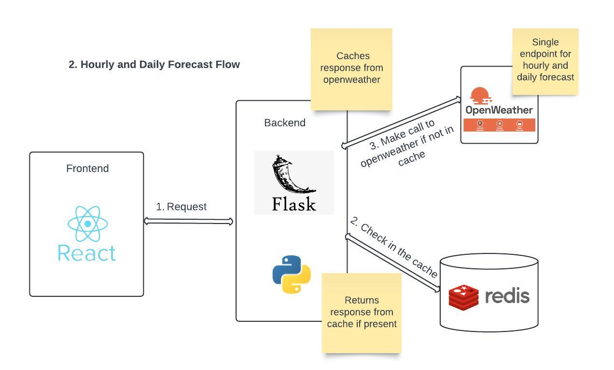

### The Weather App

Features:

1. Current/Today Weather

2. Hourly Weather Forecast for next 24 hours

3. Daily Weather Forecast for next 7 days

 

Technology Stack:
1. Frontend: React JS, Material UI
2. Backend: Python, Flask
3. Caching: Redis
4. Weather API: OpenWeatherMap

 

High Level Feature Flow:

1. Current/Today Weather

 

2. Hourly and Daily Weather Forecast 

