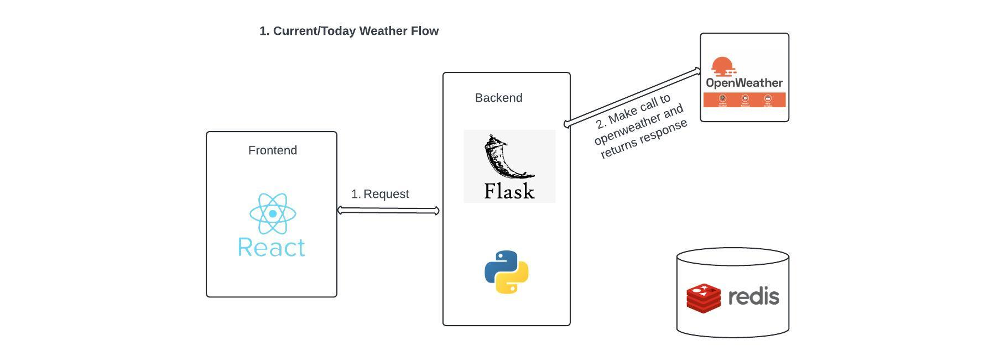

## The Weather App

[High Level Flow Diagram](#high-level-feature-flow)

[Features](#features)

[Technology Stack](#technology-stack)

### High Level Feature Flow:

1. Current/Today Weather

 

2. Hourly and Daily Weather Forecast

 

### Features:

1. Current/Today Weather

2. Hourly Weather Forecast for next 24 hours

3. Daily Weather Forecast for next 7 days

 

### Technology Stack:
1. Frontend: React JS, Material UI
2. Backend: Python, Flask
3. Caching: Redis
4. Weather API: OpenWeatherMap

 

